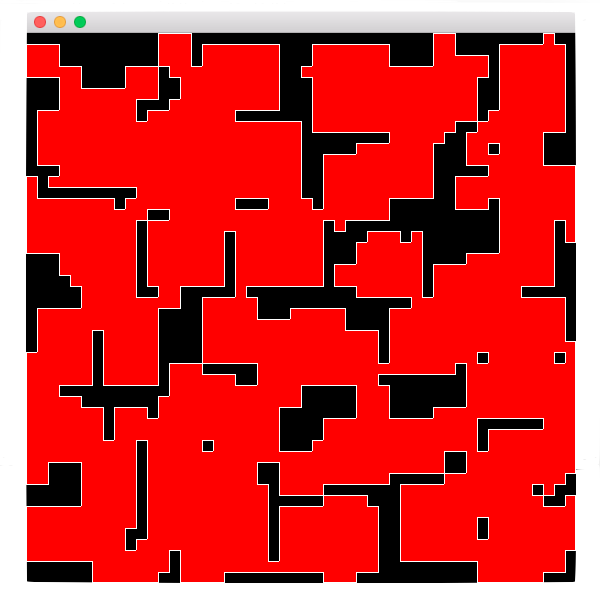

# Mazer - An attempt at Maze (Dungeon-esqe) Generation

Mazer is a relatively simple game that generates a random imperfect maze, stylized in the idea of exploring a dungeon in a retro RPG. The game uses C and SDL for the majority of its logic and entirely for graphics. However, I wanted to implement some logic in another language. Initially I thought about using Assembly (NASM) but I quickly decided that would be more trouble than it would be worth. So, I decided I would either use Fortran or Lua. I chose Fortran as I was more curious about working with it then Lua, given that I have some previous experience with Lua.

## Compiling
To compile Mazer, you will need GCC (which includes gfortran), Make, and SDL 2. Once the repository is cloned or downloaded, navigate to the parent directory (../Path/To/Mazer/, i.e. the directory that contains Makefile, Sources/, and Headers/). Run `make` and an executable named `Mazer` will be generated in the parent directory.

Please report any errors that you get.

## Note
The problems related to kernel panics seem to be caused by Allegro. I have since switched to using SDL for the rendering code and kernel panics no longer occur.
